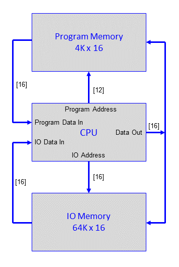
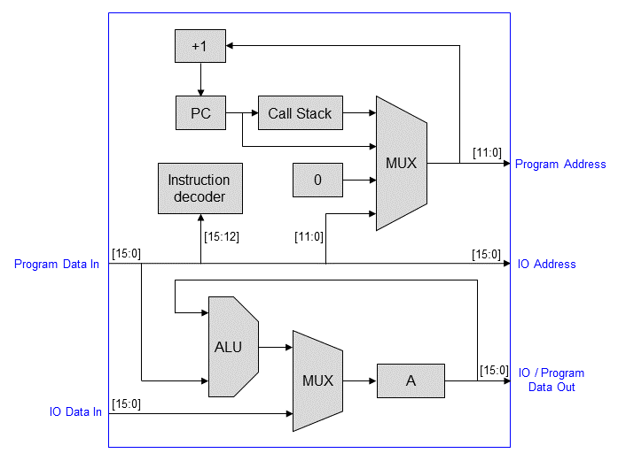

# pumpkin-cpu

pumpkin-cpu is small general purpose, scalable, 16-bit, 16 instruction soft CPU core written in VHDL. It connects to two separate memories referred to as program and IO memory. The program memory is 16 bits wide, and has a maximum size of 4K words, it is used for program code and data storage and should be implemented, at least partially, in RAM. The IO memory is also 16 bits wide, and has a maximum size of 64K words, it is used for peripherals and data storage.




##  Architecture

**Arithmetic Logic Unit**  
The 16-bit ALU supports add, subtract, or, and, xor, shift right through carry and a high/low byte swap. Except for ROR and SWAP, the ALU operates on the accumulator ('A' register) and a value fetched from program memory, the result is stored in the accumulator. The instruction word contains the address of the value to be operated on. There are no immediate instructions, instead any constant values must be placed elsewhere in program memory and referenced by the instruction. This is not quite as limiting as it may sound, values only needed defining in one place and can be used by many instructions. ROR and SWAP read the program memory and store the result in the accumulator. LOAD reads the program memory and stores the value in the accumulator. STORE writes the accumulator to program memory. Both use the same addressing scheme as the ALU instructions. STORE is the only instruction that can change the contents of the program memory.

**Carry Flag**  
The carry flag is updated by three instructions, it stores the 17th bit of the result from ADD and SUB instructions, ROR shifts right one bit right through carry. It should be noted that ADD and SUB instructions do not use the carry flag as an input.

**Program Flow**  
After reset the CPU will fetch and execute the instruction at program address 0 and continue executing instructions in sequence until a branch or call instruction is encountered. There are three branch instructions. The unconditional branch (BR) will always branch to the location referenced in the instruction. BNZ will branch if the contents of the accumulator register is not zero, BNC will branch if the carry flag is clear. CALL will call the referenced subroutine and push the return address onto the call stack. RETURN pops the return address from the stack and continues execution from there.

**Input / Output**  
IO memory is accessed by the IN and OUT instructions, IN reads a 16-bit word from IO memory, storing the value in the accumulator, OUT writes the contents of the accumulator to the IO memory. The IN and OUT instructions use indirect addressing, the memory location referenced in the instruction contains the IO address, this way 64K words can be addressed.




## Instruction Set

The 16-bit instruction word is divided into two parts. The 4-bit instruction opcode resides in the topmost 4 bits. The remaining 12-bits reference a location in program memory, except for the RETURN instruction, which ignores these bits. The table below shows the 16 instructions, along with a description and the number of clock cycles each instruction takes to execute.

```

   15    14    13    12    11    10    9     8     7     6     5     4     3     2     1     0
+-----+-----+-----+-----+-----+-----+-----+-----+-----+-----+-----+-----+-----+-----+-----+-----+
|        Op-Code        |                        Program memory address                         |
+-----+-----+-----+-----+-----+-----+-----+-----+-----+-----+-----+-----+-----+-----+-----+-----+

 A   = Accumulator 
 C   = Carry flag 
 AC  = Carry flag with accumulator 
 X   = 12-bit memory address from the instruction word 
 M   = Program memory referenced by X 
 CM  = Carry flag with program memory 
 IO  = IO memory 
 ( ) = Memory Subscript 

+-------+-----------+------+----------------------------+
|Op-code|Instruction|Cycles|Description                 |
+-------+-----------+------+----------------------------+
| 0x0   | LOAD      | 2    | A = M(X)                   |
| 0x1   | STORE     | 2    | M(X) = A                   |
| 0x2   | ADD       | 2    | AC = M(X) + A              |
| 0x3   | SUB       | 2    | AC = M(X) - A              |
| 0x4   | OR        | 2    | A = M(X) OR A              |
| 0x5   | AND       | 2    | A = M(X) AND A             |
| 0x6   | XOR       | 2    | A = M(X) XOR A             |
| 0x7   | ROR       | 2    | AC = CM(X) >> 1            |
| 0x8   | SWAP      | 2    | A = M(X) [byte-swapped]    | 
| 0x9   | IN        | 2    | A = IO(M(X))               |
| 0xA   | OUT       | 2    | IO(M(X)) = A               |
| 0xB   | BR        | 1    | Branch always              |
| 0xC   | BNC       | 1    | Branch if carry flag is 0  |
| 0xD   | BNZ       | 1    | Branch if A is not 0       |
| 0xE   | CALL      | 1    | CALL subroutine            |
| 0xF   | RETURN    | 1    | RETURN from subroutine     |
+-------+-----------+------+----------------------------+

```

## Building

The pumpkin-cpu core is defined in a single VHDL file (pumpkin.vhd), it has been tested with Lattice Diamond and Intel Quartus tool chains and should work with many others. The two generics determine the depth of the call stack and the size of the program memory in address bits. The maximum size of the program memory is 4096 words, or 12 bits. Connection to the memories is straight forward. The control signals **program_wr**, **io_rd** and **io_rd** stay active for a single clock period. The CPU reads the IO data while **io_rd** is active, this may present a problem for synchronous peripherals and memories which require one or more clock cycles for the data to be available. In this case, with suitable external logic, the **clock_enable** input can be used to pause the CPU, the same **clock_enable** must also connect to the program memory to prevent the next instruction being read too soon. 

```vhdl
entity pumpkin is
    generic(
        stack_depth     : integer := 4;
        program_size    : integer := 12);
    port (
        clock           : in std_logic;
        clock_enable    : in std_logic;
        reset           : in std_logic;
        program_data_in : in std_logic_vector(15 downto 0);
        data_out        : out std_logic_vector(15 downto 0);
        program_address : out std_logic_vector(program_size-1 downto 0);
        program_wr      : out std_logic;
        io_data_in      : in std_logic_vector(15 downto 0);
        io_address      : out std_logic_vector(15 downto 0);
        io_rd           : out std_logic;
        io_wr           : out std_logic);
end entity;
```

## Flashing LED Example

The obligatory flashing-led example program is shown below in pumpkin machine code. The program assumes the LED is connected to a register located at bit 0 of IO address 0, with read and write access. The bulk of the program consists of delay consisting of an inner and outer loop. Outside of the loop, the LED status is read, inverted, and written back. The inner loop uses the accumulator as a down counter, the outer loop uses a memory variable to keep track of the count.

```
  0x00: 0x000D    ; LOAD  [0x0D]  'Load A with 1'
  0x01: 0xA00E    ; OUT   [0x0E]  'Write A to LED port, IO address 0'
  0x02: 0x000F    ; LOAD  [0x0F]  'Load A with 30, number of outer delay loop iterations'
  0x03: 0x1011    ; STORE [0x11]  'Store A in the outer counter loop variable'
  0x04: 0x0010    ; LOAD  [0x10]  'Load A with 65535'
  0x05: 0x300D    ; SUB   [0x0D]  'Subtract 1 from A'
  0x06: 0xD005    ; BNZ   [0x05]  'Branch to 0x05 if A is not zero'
  0x07: 0x0011    ; LOAD  [0x11]  'Load A from the outer counter variable'
  0x08: 0x300D    ; SUB   [0x0D]  'Subtract 1 from A'
  0x09: 0xD003    ; BNZ   [0x03]  'Branch to 0x03 if A is not zero'
  0x0A: 0x900E    ; IN    [0x0E]  'Load A (bit 0) with the current state of the LED'
  0x0B: 0x600D    ; XOR   [0x0D]  'XOR A with 1, inverting bit 0'
  0x0C: 0xB001    ; BR    [0x01]  'Branch to 0x01'
  0x0D: 0x0001    ; 'Constant 1' 
  0x0E: 0x0000    ; 'Constant 0'
  0x0F: 0x001E    ; 'Constant 30'
  0x10: 0xFFFF    ; 'Constant 65535'
  0x11: 0x0000    ; 'Outer loop counter variable'
```

This example is in the file 'led_flash.vhd'. The top-lvel VHDL module contains an initialised RAM image and the LED register, it needs to be built alongside the CPU core 'pumpkin.vhd'. The LED will flash approximately once per second with a 12MHz clock. For faster or slower clock speeds the initial value of the outer loop counter can be adjusted.

## TODO

* Assembler
* Example using self-modifying code to emulate indirect addressing
